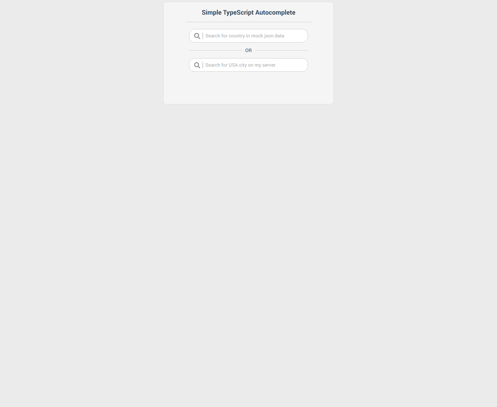

<div id="top"></div>

<!-- INTRO -->
<br />
<div align="center">
  <a href="img/3.png?raw=true">
    <p align="center">
      
    </p>
  </a>

  <h3 align="center">Simple TypeScript Autocomplete</h3>

  <p align="center">
    Small autocomplete plugin created using React/TypeScript. 
    View demo: <a href="https://codesandbox.io/p/github/nix23/simpletsautocomplete/csb-7d3gd0/draft/sad-varahamihira">Open</a>. Demo page contains 2 autocomplete instances: first one is populated with country(Name/Code) data from local data.json file and second one is loading USA city data remotely from one of my prev projects.
  </p>
</div>

<!-- USAGE -->
## Usage

* If you have docker/docker compose installed type:
  ```sh
    docker-compose build
    docker-compose up &
    // page can be accessed at localhost:3300
  ```

* Alternatively you can serve index.html from /public dir with any web-server:
  ```sh
     // Example: with php built-in server:
     php -S 0.0.0.0:8001
  ```

<!-- DEVELOPMENT BUILD -->
## Development build

* To start webpack development server type:
  ```sh
    npm install
    npm start
  ```

<!-- PRODUCTION BUILD -->
## Production build

* To create production build type:
  ```sh
    npm install
    npm run-script build
  ```

<!-- TESTING -->
## Testing

* To run jest tests suite type:
  ```sh
    npm test
  ```

<!-- CODEBASE SHORT OVERVIEW -->
## Codebase Short Overview

### /src

* /src/Autocomplete: contains all required components for Autocomplete functionality
* /src/Autocomplete/data.json: json file with countries list data
* /src/Ui: contains basic css files as well as a few presentational components
* /src/Util: contains string/math helpers for project + useDebounce hook
* /src/__tests__: contains tests for Autocomplete component
* /src/index.tsx: react app entry point
* /src/App.tsx: creates app layout and includes 1 route for autocomplete scene demo

### /

* docker-compose.yml: launches apache to serve index.html from /public dir
* jest-setup.ts/jest-config.ts: config to launch tests suite
* tsconfig.json: TypeScript config
* webpack.common.js: Core webpack config: it is used both by dev/prod builds
* webpack.dev.js: Webpack config for development: will start web-development-server
in watch mode.
* webpack.prod.js: Webpack config for production: will make minified build
and dump all required assets into `/public` folder. 

### /conf

* Docker and apache config files

### /public

* Generated assets for prod build + index.html file. Apache will serve files from this directory.